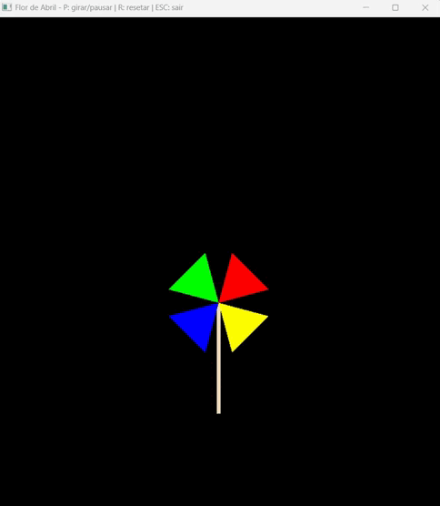

# 🌸 Catavento - Flor de Abril

Programa em **Python + OpenGL** que desenha um catavento (inspirado na flor de Abril da atividade anterior) para a segunda atividade da disciplina de Computação Gráfica.  
Ele gira no sentido horário ao pressionar a tecla **P**.

## 📋 Tecnologias

- [PyCharm](https://www.jetbrains.com/pycharm/)
- [Python](https://www.python.org/)
- [OpenGL](https://www.opengl.org/)

## 📋 Requisitos

- Python 3.8 ou superior
- [PyOpenGL](http://pyopengl.sourceforge.net/)
- [PyOpenGL_accelerate](https://pypi.org/project/PyOpenGL-accelerate/)

Instale as dependências com:

```bash 
pip install PyOpenGL PyOpenGL_accelerate
```

## ▶️ Como executar na sua máquina 

1. Clone este repositório:

```bash 
git clone https://github.com/laravitoriabarros/atividade02-flordeabril.git
cd atividade02-flordeabril
```

2. Execute o programa:

```bash
python main.py
```

## 🎮 Controles

P → Iniciar/Pausar rotação

R → Resetar ângulo

ESC → Sair

## 📽️ Resultados




